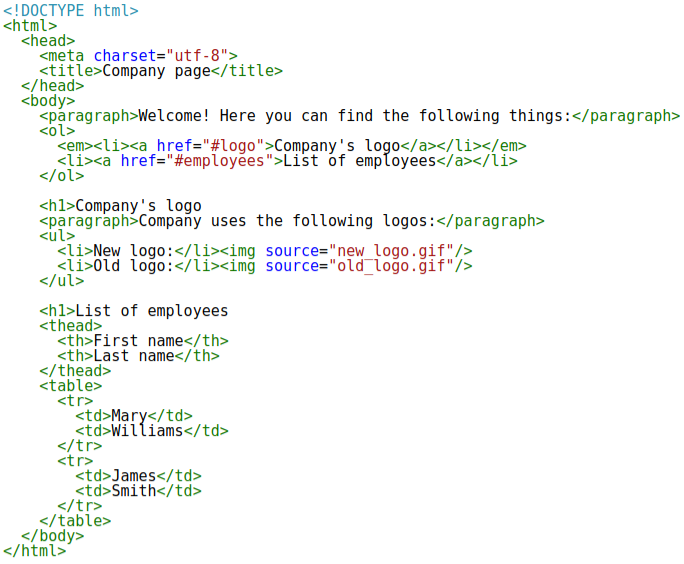
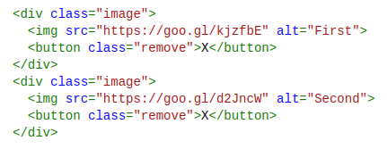
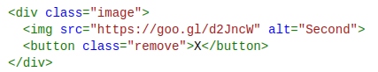

# Vaga Estagiário
Nós estamos sempre em busca de profissionais interessantes e interessados, com boa capacidade de aprendizado, adaptação e principalmente gente boa.

Esse teste é para vaga de estagiário para área de desenvolvimento.

## O que preciso saber para fazer o teste?

Só precisa saber (ou aprender agora) um pouco sobre as seguintes tecnologias:

- HTML
- CSS
- Javascript
- Git

## Regras
Faça um `Fork` desse repositório, crie uma `branch` com seu nome completo, complete os desafios e peça um `Pull Request` da sua `branch`.

## Desafio HTML
Resolva os bugs do html da imagem abaixo:

## Desafio JS
Construa uma função em JS que apresente o seguinte comportamento:
- Dado o seguinte HTML:

	
- Ao clicar no botão 'X' a `div` que contenha esse botão deverá ser removida.
- Resultando no seguinte HTML:

    

# 
Show me the code!

